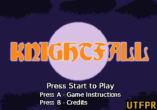

# KnightFall

A strategic, chess-inspired game developed for the Sega Genesis.

## Credits

[Stephane Dallongeville](https://github.com/Stephane-D), because without its [SGDK](https://github.com/Stephane-D/SGDK), this project wouldn't be completed.

[JDWasabi](https://jdwasabi.itch.io/), by its [sound effects](https://jdwasabi.itch.io/8-bit-16-bit-sound-effects-pack). 
[Monkii](https://monkii-man.itch.io/), also by its [sound effects](https://monkii-man.itch.io/chess-peice-dungeon-assets).

[Safety Stoat Studios](https://itch.io/profile/safetystoatstudios), by its free [vgm musics](https://safetystoatstudios.itch.io/free-vgms).

